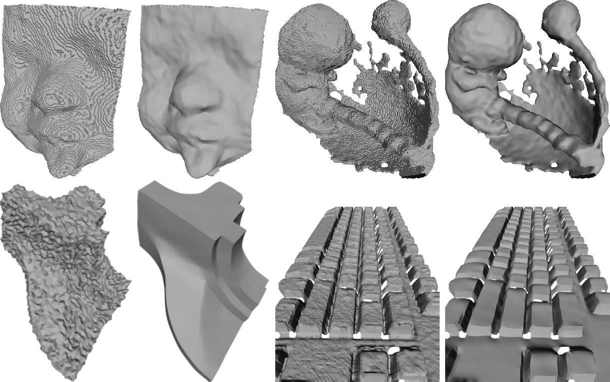

# ADAPTIVE PATCHES FOR MESH DENOISING

### [Paper] [https://ieeexplore.ieee.org/document/8614304](https://ieeexplore.ieee.org/document/8614304)


## Authors 
[Jan Hurtado](https://scholar.google.com/citations?user=5WJK29sAAAAJ&hl=es), [Marcelo Gattass](https://scholar.google.com/citations?user=zrRqeM8AAAAJ&hl=en), [Alberto Raposo](https://scholar.google.com/citations?user=bbNfBlwAAAAJ&hl=en), and [Jeferson Coelho]().
Tecgraf PUC-Rio 

## Abstract

The generation of triangular meshes typically introduces undesired noise which comes from different sources. Mesh denoising is a geometry processing task to remove this kind of distortion. To preserve the geometric fidelity of the desired mesh, a mesh denoising algorithm must maintain the object details while removing artificial high-frequencies from the surface. In this work, we propose a two-step algorithm which uses adaptive patches and bilateral filtering to denoise the normal vector field, and then update vertex positions fitting the faces to the denoised normals. The computation of the adaptive patches is our main contribution. We formulate this computation as local quadratic optimization problem that can be controlled by a set of parameters to obtain the desired behavior. We compared our proposal with several algorithms proposed in the literature using synthetic and real data. Our algorithm yields better results in general and is based on a formal mathematical formulation.



[](https://www.youtube.com/watch?v=e8DpA9s0QUU)


## Citation

```
@inproceedings{hurtado2018adaptive,
  title={Adaptive patches for mesh denoising},
  author={Hurtado, Jan and Gattass, Marcelo and Raposo, Alberto and Coelho, J{\'e}ferson},
  booktitle={2018 31st SIBGRAPI conference on graphics, patterns and images (SIBGRAPI)},
  pages={1--8},
  year={2018},
  organization={IEEE}
}
```

## License
Our code is released under MIT License (see LICENSE file for details).